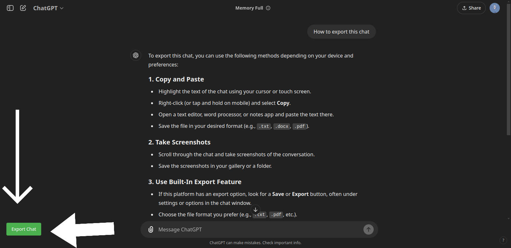

---

# ChatGPT Chat Exporter  
**_Yet Another Extension Nobody Asked For._**

So, you’re here because you decided you absolutely *must* export your ChatGPT conversation history in JSON format. Why? Nobody knows. You do you. It’s not like ChatGPT doesn’t already offer a perfectly good way to download your data. Who am I to judge?  

## Why Use This Extension?  
Not sure
## Features (If You Can Call Them That)  
- Exports ChatGPT conversations in **JSON** format, because *why not?*  
- Minimalist design. (We’re just pretending this was intentional.)  
- Icons that are way cooler than the functionality of the extension itself.

  

## Installation Instructions  
[Follow this lovely documentation by Google to know how to unload an extension locally.](https://developer.chrome.com/docs/extensions/get-started/tutorial/hello-world#load-unpacked)
I have not published it on chrome extension store, neither do I know if there are better ones available. 


1. Clone this repository:  
   ```bash  
   git clone https://github.com/GentleClash/chatgpt_chat_export  
   ```  

2. Open Chrome (or a Chromium-based browser if you're into that).  

3. Navigate to the extensions page:  
   - Type `chrome://extensions/` in the address bar, or [just Google it you forgot](https://letmegooglethat.com/?q=how+to+unload+local+extensions+in+chrome+browser).  

4. Enable **Developer Mode** (just like that).  

5. Click on **"Load unpacked"**.  

6. Select the directory containing this extension.  


## Usage Instructions  
1. Open ChatGPT coversation page.  
2. Click the extension icon.
3. A button to export chat will become visible. Either use that or click on the extension icon again. 

  
I am not responsible for any bugs that happen because, I didn’t test it thoroughly. You can open a PR if you want. 

---
(the repo will not be developed further)